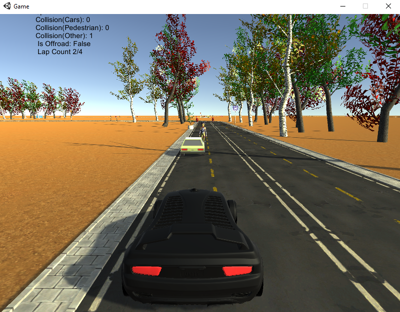
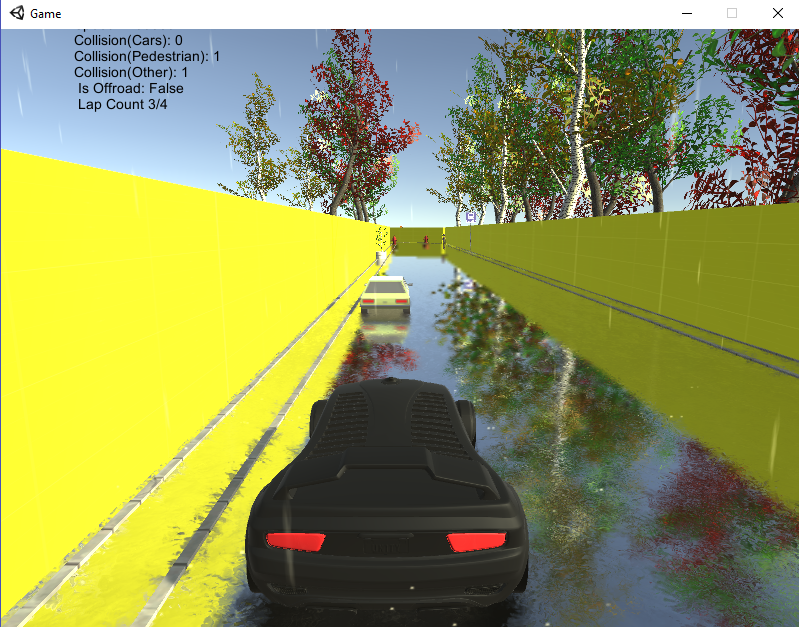

# CarGame-Unity
A simple car game for logging user playing data
This game was create to enable us to gather data related to our research paper.

## Prerequisites
Few assets are not included in this directory. They were obtained from asset store and the internet.
Links are given below.

Standard Assets

- [LowpolyStreetPack](https://assetstore.unity.com/packages/3d/environments/urban/low-poly-street-pack-67475)

- [MoveMotionPack](https://assetstore.unity.com/packages/3d/animations/move-motion-free-pack-25900)

- [Simple Vehicle Pack](https://assetstore.unity.com/packages/3d/vehicles/land/simple-cars-pack-97669)

- [low poly buildings](https://free3d.com/3d-model/19-low-poly-buildings-974347.html)

## License
Released under MIT License